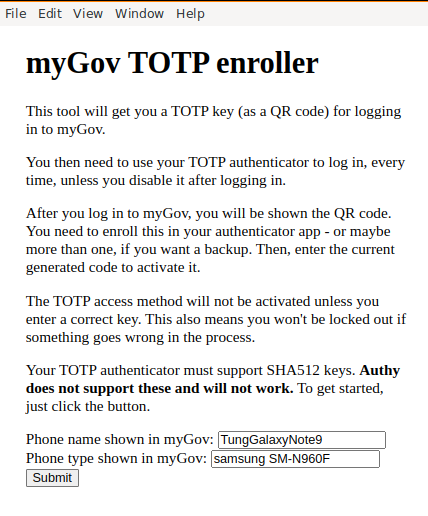
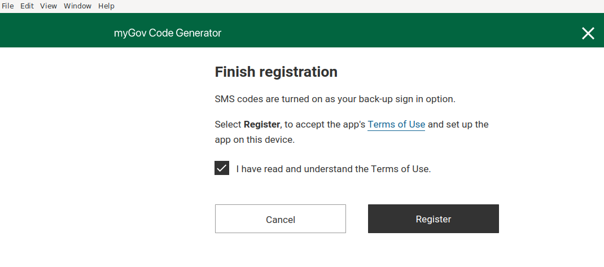
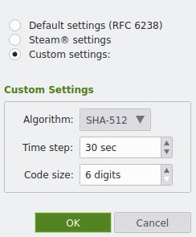

Clone the repo and create an Ubuntu distrobox:

```
git clone git@github.com:tungel/mygov-totp-enroll.git

# then create ubuntu distrobox
ttl in ttlworld in ~/mytemp/mygov-totp-enroll
❯ distrobox create -i ubuntu:20.04
```

Enter into it:

```
❯ distrobox list
ID           | NAME                 | STATUS                         | IMAGE
f302b8a41a33 | ubuntu-20-04         | created                        | ubuntu:20.04

ttl in ttlworld in ~/mytemp/mygov-totp-enroll
❯ distrobox enter ubuntu-20-04
```

Now, inside the ubuntu box:

```
$ npm install

$ npm start

> mygov-totp-enroll@0.1.0 start
> electron .

/home/ttl/mytemp/mygov-totp-enroll/node_modules/electron/dist/electron: error while loading shared libraries: libgobject-2.0.so.0: cannot open shared object file: No such file or directory


# Search package that contain a file using https://packages.ubuntu.com/search?mode=exactfilename&suite=xenial&section=all&arch=any&keywords=libgtk-3.so.0&searchon=contents
# to fix the missing dependencies, run below command:
$ sudo apt install libglib2.0-0 libnss3 libatk1.0-0 libatk-bridge2.0-0 libcups2 libgtk-3-0 libasound2


$ npm start

> mygov-totp-enroll@0.1.0 start
> electron .

[809934:0628/105323.682305:ERROR:bus.cc(399)] Failed to connect to the bus: Failed to connect to socket /var/run/dbus/system_bus_socket: No such file or directory
Authorization required, but no authorization protocol specified
[809934:0628/105323.888555:ERROR:ozone_platform_x11.cc(239)] Missing X server or $DISPLAY
[809934:0628/105323.888578:ERROR:env.cc(255)] The platform failed to initialize.  Exiting.
The futex facility returned an unexpected error code.
/home/ttl/mytemp/mygov-totp-enroll/node_modules/electron/dist/electron exited with signal SIGABRT

$ echo $DISPLAY
:0

$ echo $XAUTHORITY
/home/ttl/.Xauthority
```

on the host machine (Arch Linux), I have to run below command to fix the `Authorization required, but no authorization protocol specified`
error above.

```
❯ xhost +
access control disabled, clients can connect from any host
```

Ref: https://github.com/89luca89/distrobox/issues/329

> You need to have xhost running on the host. You also need to run xhost + and/or xhost +si:localuser:$USER to grant yourself appropriate privileges.


I use below input:


- Phone name shown in myGov: TungGalaxyNote9
- Phone type shown in myGov: samsung SM-N960F






After that, the electron app works until the step where I need to verify the 2FA
code. The app was stuck at showing "Loading..." screen. Not sure why. I had to add
a few logs to print out the required values so that I can manually make the API
request to verify the 2FA code.


The logs printed out look something like this

```
Trying to go to...
au.gov.my://app?state=xxxxxxxxxxxxxxxxxxxxxxxxxxxxxxxxxxxxxxxx&code=xxxxxxxxxxxxxxxxxxxxxxxxxxxxxx
Requesting OAuth token...
token is: xxxxxxxxxxxxxxxxxxxx
Requesting OAuth secret...
secret is: xxxxxxxxxxxx/xxxxxxxxxxxxxxxxxxx/xxxx/xxxxxxxxx/xxxxxxxxxxxxxxxxxxxx+xxxxxxxxxxxxxxxxx==
secret32 first: xxxxxxxxxxxxxxxxxxxxxxxxxxxxxxxxxxxxxxxxxxxxxxxxxxxxxxxxxxxxxxxxxxxxxxxxxxxxxxxxxxxxxxxxxxxxxxxxxxxxxxx=
secret32 second: xxxxxxxxxxxxxxxxxxxxxxxxxxxxxxxxxxxxxxxxxxxxxxxxxxxxxxxxxxxxxxxxxxxxxxxxxxxxxxxxxxxxxxxxxxxxxxxxxxxxxxx
totp_uri: otpauth://totp/myGov?secret=xxxxxxxxxxxxxxxxxxxxxxxxxxxxxxxxxxxxxxxxxxxxxxxxxxxxxxxxxxxxxxxxxxxxxxxxxxxxxxxxxxxxxxxxxxxxxxxxxxxxxxx&algorithm=SHA512
```

Copy the `secret32 second` value and set up TOTP in KeePassXC like this
(remember to select `SHA-512`):




Then reading the JavaScript code, I manually construct the REST API request to
verify my 2FA code:

```
curl --location 'https://api.my.gov.au/authbiz-ext-sec/api/v1/authclients/g2c2pjLUThOaBumECqbf/totpverify.json' \
--header 'Content-Type: application/json' \
--header 'Authorization: Bearer <token-value-from-the-log>' \
--data '{
    "password": "<the-totp-code-generated-by-keepassxc>"
}'
```

Then it works! Enjoy.

